# MeinProjekt – GitHub Repository Setup und Workflow

## 📝 Einführung

In diesem Projekt wird Schritt für Schritt erklärt, wie man ein GitHub-Repository erstellt, mit einem SSH-Schlüssel absichert, lokal klont, konfiguriert und typische Workflows mit Branches, Commits und Merges durchführt.

## ✅ Voraussetzungen

- [x] GitHub-Konto erstellt
- [x] SSH-Key generiert
- [x] Repository erstellt
- [x] Git konfiguriert
- [x] Lokales Repository geklont


## 🧩 GitHub Repository Setup

- Konto bei GitHub erstellt / eingeloggt


- Neues Repository namens **"MeinProjekt"** erstellt

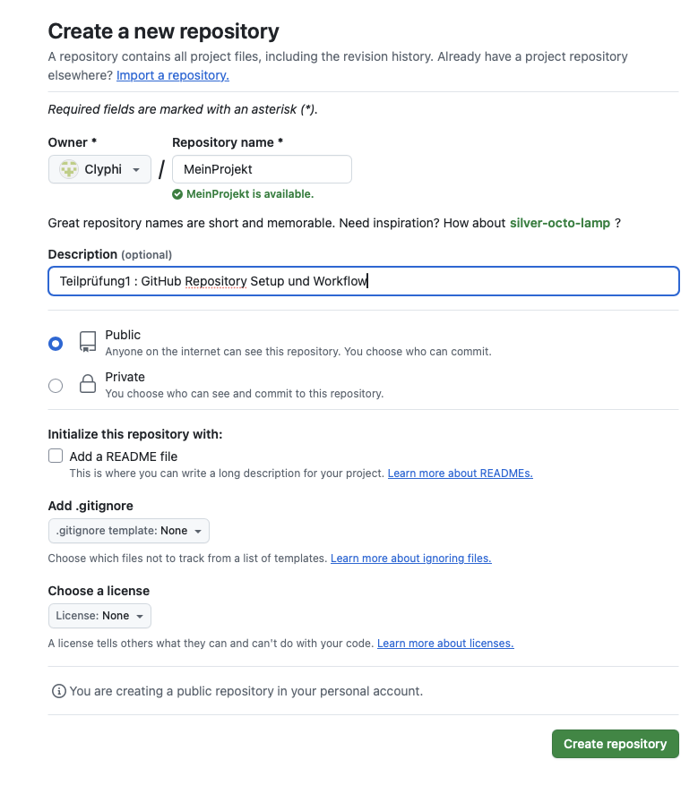

- Repository-URL (SSH): `git@github.com:Clyphi/MeinProjekt.git`

## 🔑 SSH-Schlüssel

- Im Terminal geprüft: `ls ~/.ssh/`

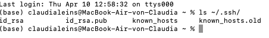

- SSH-Schlüssel bereits vorhanden: `ssh-keygen -t rsa -b 4096 -C "leins.claudia@wtnet.de"`

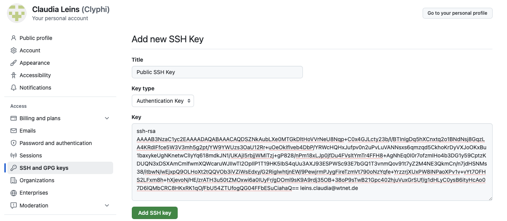

- Skript für public SSH-Key
Kopiert den öffentlichen SSH-Schlüssel in die Zwischenablage
(Verhindert, dass man Ausversehen den privaten SSH-Schlüssel weitergibt.)

```bash
#!/bin/bash

# Zeigt den öffentlichen SSH-Schlüssel an
PUB_KEY=$(cat ~/.ssh/id_rsa.pub)

# Kopiert den Schlüssel in die Zwischenablage (macOS / Linux)
if command -v pbcopy &> /dev/null; then
  echo "$PUB_KEY" | pbcopy
  echo "Dein öffentlicher SSH-Schlüssel wurde in die Zwischenablage kopiert!"
elif command -v xclip &> /dev/null; then
  echo "$PUB_KEY" | xclip -selection clipboard
  echo "Dein öffentlicher SSH-Schlüssel wurde in die Zwischenablage kopiert!"
else
  echo "Fehler: Keine geeignete Kopiermethode gefunden. Bitte kopiere den Schlüssel manuell."
  echo "$PUB_KEY"
fi
```

## 💻 Lokales Repository & Workflow

- Repository lokal geklont: `git clone git@github.com:Clyphi/MeinProjekt.git`

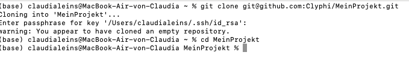

- Git konfiguriert: `user.name`, `user.email`

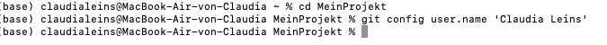
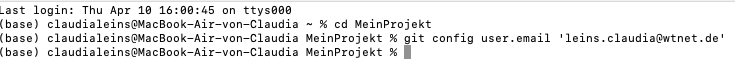

- `main.py` erstellt und erster Commit

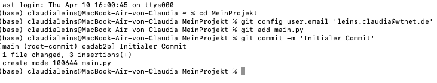

- Branch `feature` erstellt

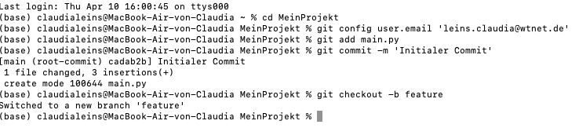

- `utils/database.py` hinzugefügt und commitet

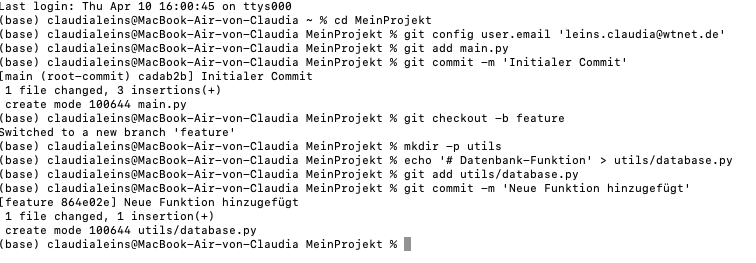

- `main.py` im Feature-Branch geändert

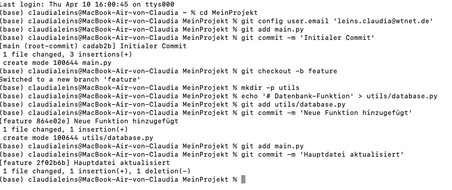

- Zurück auf `master`, `main.py` erneut geändert Fehlermeldung.

Mit 'git branch' die Namen der Branches überprüft.

Hauptbranch heißt nicht 'master' sondern 'main'.

Änderung: 'git checkout main' statt 'git checkout master' eingegeben.

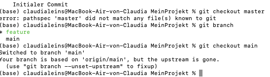

- Merge durchgeführt → Merge-Konflikt

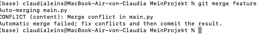

- Merge-Konflikt manuell gelöst und committed

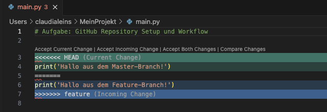


## 📁 Verzeichnisstruktur

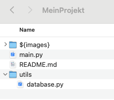

## 🧠 Nützliche Git-Befehle

| Befehl                     | Bedeutung                                 |
|----------------------------|-------------------------------------------|
| `git clone`                | Klont ein Repository                      |
| `git status`               | Zeigt den aktuellen Status                |
| `git add <datei>`          | Fügt alle Änderungen zum Staging hinzu    |
| `git commit -m "msg"`      | Commitet die Änderungen mit Nachricht     |
| `git branch`               | Listet alle Branches                      |
| `git checkout <branch>`    | Wechselt zu einem anderen Branch          |
| `git merge <branch>`       | Führt Branch in aktuellen Branch zusammen |
| `git log`                  | Zeigt Historie der Commits                |
| `git push`                 | Überträgt lokale Änderungen zu GitHub     |


## 🔗 Weitere Ressourcen

- [Git – Offizielle Doku](https://git-scm.com/doc)
- [SSH-Zugang zu GitHub einrichten](https://docs.github.com/en/authentication/connecting-to-github-with-ssh)
- [VSCode Markdown Guide](https://code.visualstudio.com/docs/languages/markdown)
- [GitHub Docs – Erste Schritte mit Git](https://docs.github.com/en/get-started/quickstart)
- [GitHub Docs – Branches erstellen und verwalten](https://docs.github.com/en/get-started/using-git/creating-and-deleting-branches)
- [Markdown Cheat Sheet (GitHub)](https://github.com/adam-p/markdown-here/wiki/Markdown-Cheatsheet)
- [Oh My Git! – Interaktives Git-Lernspiel](https://ohmygit.org/)
- [Pro Git Buch (online & kostenlos)](https://git-scm.com/book/de/v2)


